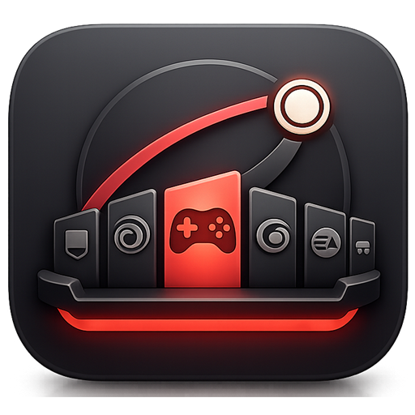
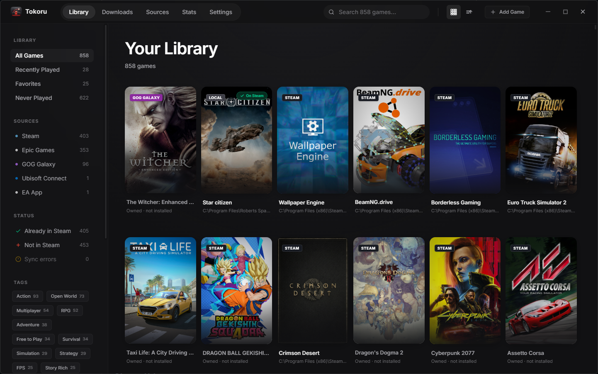

<p align="center">
  <picture>
    <source media="(prefers-color-scheme: dark)" srcset="public/logo-dark.png" />
    <source media="(prefers-color-scheme: light)" srcset="public/logo-light.png" />
    
  </picture>
</p>

<p align="center">
  <strong>The unified game launcher for Windows</strong>
</p>

<p align="center">
  Scan every launcher (Steam, Epic, GOG, Ubisoft, EA, Itch.io), push your games into Steam as non-Steam shortcuts, and sync your real cross-platform playtime back into your Steam profile.<br/>
  No subscription. No telemetry. Local only.
</p>

<p align="center">
  <a href="https://github.com/drrakendu78/tokoru/blob/main/LICENSE"></a>
  <a href="https://github.com/drrakendu78/tokoru/commits/main"></a>
  
  
</p>

<p align="center">
  
</p>

---

## Features

- **Multi-launcher Library Scan** - Detect installed games from Steam, Epic Games (Legendary), GOG Galaxy (gogdl), Ubisoft Connect, EA App, Itch.io, Xbox Game Pass, and Amazon Games. Add custom `.exe` paths manually.
- **Push to Steam as Shortcuts** - Write `shortcuts.vdf` with per-source collections (Epic Games / GOG Galaxy / Ubisoft / ...) and per-platform colored badges. Multi-select bulk push with auto-restart.
- **Cross-Platform Playtime Sync** - Track session-by-session playtime locally, import `playtime_forever` from Steam/Epic/GOG APIs, and write it back into Steam's `localconfig.vdf` so your Steam profile reflects your real total time played.
- **SteamGridDB Artwork Picker** - Browse cover / hero / logo / icon artworks per game with built-in filters (static / animated / NSFW). Auto-fetch on add, mirrored to Steam's grid folder so Steam itself shows the new art.
- **Metadata Enrichment** - Steam Store + SteamSpy + IGDB + HowLongToBeat + Wikidata for Steam games. Direct GOG API for GOG games. RAWG.io fallback (500k+ titles) for everything else, including Star Citizen and Itch-only games.
- **Achievements** - Cross-launcher unified view: Steam community XML + GOG Galaxy API. Global stats page aggregates progress across your whole library.
- **Steam Favoris Sync** - Two-way sync between Tokoru's heart icon and Steam's Favorites collection. Automatic restart so it applies immediately.
- **Star Citizen Playtime** - Parses `logbackups/*.log` across every channel (LIVE / PTU / EPTU) to compute real time played even when the RSI Launcher rotates older logs.
- **Stats Dashboard** - Activity heatmap (12 months, GitHub-style), top 10 by playtime, sessions over time, most active day, untouched games, global achievements.
- **Multi-select + Bulk Actions** - Push N to Steam, Fetch artwork for selection, Add custom tags in one click.
- **User-curated Tags** - Per-game personal tags, editable from a chip modal, surfaced in the Library sidebar filter.
- **Dark + Light Theme** - Full theme switch with theme-aware artwork badges and acrylic chrome.
- **i18n** - Complete UI translation in 10 locales: FR / EN / ES / DE / IT / PT / RU / ZH / JA / KO.

## What's New

- 3-tab Game Detail layout (Overview / Artworks / Technical properties).
- Bulk-action floating bar in Library with auto-restart on push.
- GOG-native metadata fetch via `api.gog.com/products`.
- RAWG.io universal fallback covering games not on any major store.
- Steam icon override for shortcuts (SARM-style `.jpg`-forced grid write + `shortcuts.vdf` icon field update).
- Custom Steam Favoris collection auto-created when missing.

## Installation

### Manual Build (only path for now — alpha, no public release yet)

See [Building from Source](#building-from-source) below.

A signed Windows installer + auto-updater are on the roadmap (Phase 4).

## Quick Start

1. **Launch Tokoru** — first run opens the onboarding wizard.
2. **Sign in to Steam / Epic / GOG** from the Sources page (each in turn — Steam first because we use the cookie for everything).
3. **Scan your library** — Tokoru detects installed games + pulls your owned-but-not-installed catalog from Epic and GOG.
4. **Push to Steam** — multi-select your favorites and hit `Push N to Steam`. Steam auto-restarts to pick up the new shortcuts.
5. **Open a game** to see the full metadata, artwork picker, and achievements progress.

## Tech Stack

| Component | Technology |
|-----------|-----------|
| Framework | [Tauri 2](https://v2.tauri.app/) |
| Frontend | React 18 + TypeScript + Vite |
| Styling | Tailwind CSS v4 |
| Backend | Rust + Tokio |
| Database | SQLite (rusqlite) |
| i18n | react-i18next (10 locales) |
| Virtualization | @tanstack/react-virtual |
| Embedded CLIs | [Legendary](https://github.com/derrod/legendary) (Epic) + [gogdl](https://github.com/Heroic-Games-Launcher/heroic-gogdl) (GOG) |
| External APIs | Steam Web/Store/Community, Epic, GOG, SteamGridDB, IGDB, SteamSpy, HowLongToBeat, Wikidata, RAWG.io |

## Building from Source

### Prerequisites

- [Node.js](https://nodejs.org/) (v18+)
- [Rust](https://www.rust-lang.org/tools/install) (stable)
- [Tauri CLI](https://v2.tauri.app/start/prerequisites/)

### Steps

```bash
# Clone the repository
git clone https://github.com/drrakendu78/tokoru.git
cd tokoru

# Install dependencies
npm install

# Run in development
npm run tauri dev

# Build for production
npm run tauri build
```

## Credits / Inspirations

- [Boilr](https://github.com/PhilipK/BoilR) — `shortcuts.vdf` binary format + Steam Collections.
- [SARM](https://github.com/Tormak9970/Steam-Art-Manager) — grid / icon write patterns (the `.jpg`-no-matter-what trick).
- [Heroic Games Launcher](https://github.com/Heroic-Games-Launcher/HeroicGamesLauncher) — `gogdl` + Epic/GOG patterns.
- [Playnite](https://playnite.link/) — the all-in-one library philosophy.
- [aidesigner.ai](https://www.aidesigner.ai/) — screen design iterations.

## Contributing

Tokoru is alpha and under active personal development. Issues and PRs are welcome.

## License

This project is licensed under the [MIT License](LICENSE).

## Non-affiliation

Tokoru is **not** affiliated with Valve, Epic Games, GOG, Ubisoft, EA, Cloud Imperium Games, Microsoft, Amazon, or any of the platforms it scans. Trademarks remain the property of their respective owners.

---

<p align="center">
  Made with Rust and React by <a href="https://github.com/drrakendu78">Drrakendu78</a>
</p>
